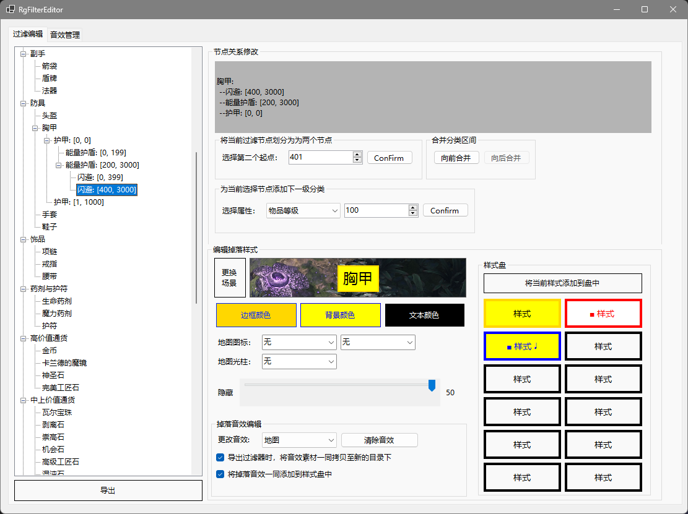

# RgFilterEditor

1. 流放之路2 (POE2) 的过滤制作器，它可以
    1. 即时预览掉落样式
    2. 准确编辑限制范围
    3. 音效预览与配置
    4. 样式预制盘

2. 适用游戏版本: 0.1.1

3. 后续计划：
    1. 全局管理，优先标记高价值白装与暗金装备
    2. 读取/导入已有配置表
    3. 自定义配置表基底
    4. 扩展显示掉落物品图标

---

1. Path of Exile 2 filter maker, it can:
    1. Instant preview of the drop style
    2. Edit limits ranges accurately
    3. Sound preview and configuration
    4. Style prefabricated discs

2. Game version is Compatible with 0.1.1

3. Next Steps:
    1. Global management, giving priority to marking high-value white and dark gold equipment
    2. Read/import existing configuration tables
    3. Customize the table base
    4. Expanded the display of dropped item icons

---

